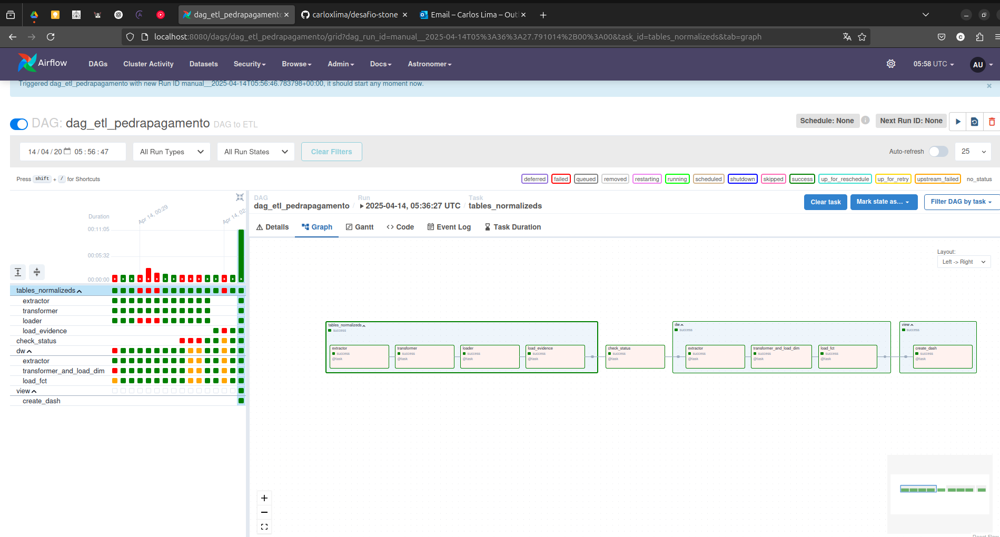

# Desafio Stone — ETL com Apache Airflow

Este projeto tem como objetivo demonstrar a construção de um pipeline de ETL utilizando Apache Airflow com o Astro CLI.

## ✅ Como Executar o Projeto

Siga os passos abaixo para configurar e executar o ambiente.

### 1. Clonando o Repositório

```bash
git clone https://github.com/carloxlima/desafio-stone.git
cd desafio-stone
```

### 2. Instalando o Astro CLI

#### Mac e Linux:

```bash
/bin/bash -c "$(curl -fsSL https://raw.githubusercontent.com/Homebrew/install/HEAD/install.sh)"
brew install astro
```

#### Windows:

Instale o WSL (Windows Subsystem for Linux). Em seguida, siga os passos para Mac/Linux dentro do terminal WSL.

### 3. Iniciando o Ambiente

```bash
astro dev start
```

Esse comando criará os containers do Airflow e do banco de dados Postgres, além de instalar as dependências.

---

## 🗄️ Configuração do Banco de Dados

### Cliente (ex: DBeaver):

- Host: `localhost`
- Porta: `5132`
- Usuário: `postgres`
- Senha: `postgres`

Crie a base de dados manualmente:

```sql
CREATE DATABASE dbpedrapagamentos;
```

### Conexão no Airflow:

- Connection Id: `postgres_conn`
- Connection Type: `Postgres`
- Host: `postgres`
- Database: `dbpedrapagamentos`
- Login: `postgres`
- Password: `postgres`
- Port: `5432`

---

## 🧩 DAGs Disponíveis

### 1. `init_create_tables`

Cria as tabelas necessárias no banco.  
**Execute esta DAG primeiro.**

### 2. `dag_etl_pedrapagamento`

DAG principal com 8 tasks:

1. Leitura dos arquivos no bucket.
2. Tratamento dos dados.
3. Carga nas tabelas normalizadas.
4. Armazenamento dos comprovantes.
5. Verificação de logs processados.
6. Extração de dados das tabelas normalizadas.
7. Transformação e carga nas dimensões.
8. Carga na tabela fato.

---

## ✨ Observações

- Utilize o Airflow UI em `http://localhost:8080`
- Todas as DAGs estão no diretório `dags/`
- As conexões e variáveis devem ser configuradas na interface do Airflow

---

## 🧾 Descrição das Tabelas

- **`tb_process_log`**: Registra o status de processamento de arquivos no pipeline, indicando a etapa, sucesso ou falha, mensagens de erro e o nome do arquivo processado.

- **`tb_evidence_log`**: Armazena logs de evidências associadas aos pedidos, como comprovantes de atendimento, com informações sobre status de atendimento conluido ou não.

- **`tb_cancellation_reasons`**: Contém os motivos de cancelamento utilizados pelos pedidos. Referenciada na tabela de pedidos (`tb_orders`).

- **`tb_customers`**: Guarda os dados básicos dos clientes, como o telefone. Serve como entidade central para relacionar pedidos e endereços.

- **`tb_orders`**: Tabela principal com os dados dos pedidos, como fornecedor, técnico, datas, modelo de terminal, entre outros. Relaciona-se com os clientes e os motivos de cancelamento.

- **`tb_addresses`**: Armazena os endereços associados aos clientes, com campos como cidade, estado, país, rua, e complemento.

---

## 🧾 Descrição das Tabelas do Data Warehouse

- **`dim_customers`**: Dimensão de clientes. Contém o ID original do cliente e o número de telefone.

- **`dim_addresses`**: Dimensão de endereços. Armazena os dados geográficos relacionados ao cliente, como cidade, estado, país e outros detalhes do endereço.

- **`dim_cancellation_reasons`**: Dimensão dos motivos de cancelamento. Representa os diferentes tipos de cancelamento utilizados no processo.

- **`dim_terminals`**: Dimensão dos terminais. Guarda dados técnicos dos equipamentos utilizados nos pedidos, como número de série, modelo e tipo.

- **`dim_technicians`**: Dimensão de técnicos. Contém os e-mails dos técnicos responsáveis pelas ordens de serviço.

- **`fct_orders`**: Fato principal do projeto. Representa os pedidos realizados, com chaves para todas as dimensões relevantes (cliente, endereço, técnico, terminal e motivo de cancelamento), além de informações como datas e fornecedor.

---

## 🖼️ Exemplo de Execução

Abaixo, um exemplo da execução do ambiente com o Astro CLI e Airflow rodando corretamente:

